# 1. rpc核心原理

一种透明调用机制,屏蔽各种编码,传输等细节.

### 1.1 网络通信过程

+ 对端节点查找
+ 网络连接建立
+ 传输数据编解码
+ 网络连接管理

### 1.2 服务治理

+ 连接管理
+ 健康检测
+ 负载均衡
+ 优雅启停机
+ 异常重试
+ 业务分组
+ 熔断限流

## 2. 基本流程

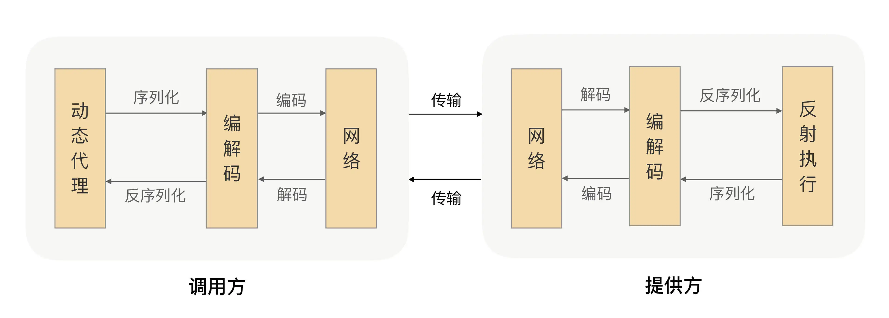

## 2.1 rpc在架构中的位置

##### RPC 框架能够帮助我们解决系统拆分后的通信问题，并且能让我们像调用本地一样去调用远程方法

## 2.2 rpc其它应用场景

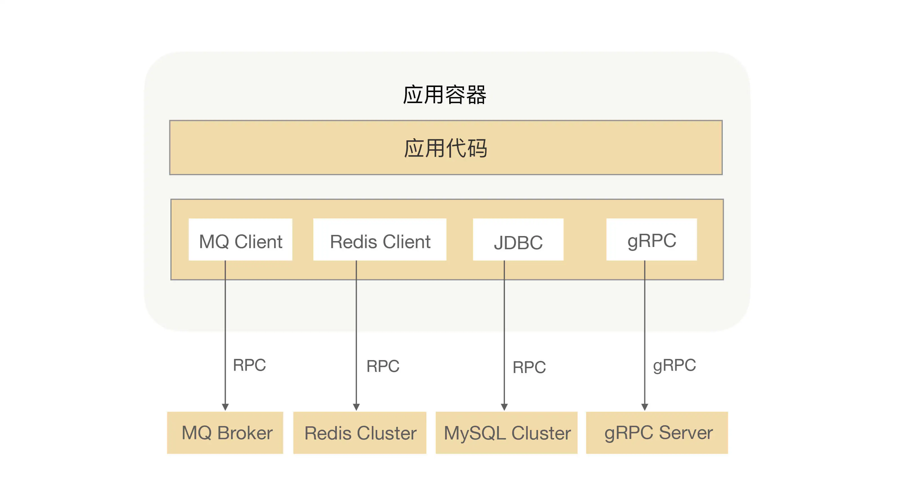

+ MQ处理异步流程
+ Redis缓存热点数据
+ MySQL持久化数据
+ 业务间相互调用

## 3. rpc协议

#### rpc协议是围绕应用层协议展开的

### 3.1 协议的作用

理解对方数据的语义,同等实体间正确高效的交流.

+ 识别边界
+ 协议头、协议体

##### 定长协议:

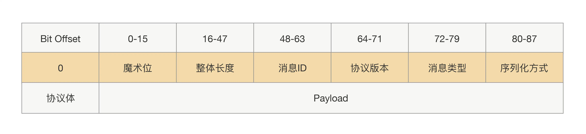

##### 可扩展协议:

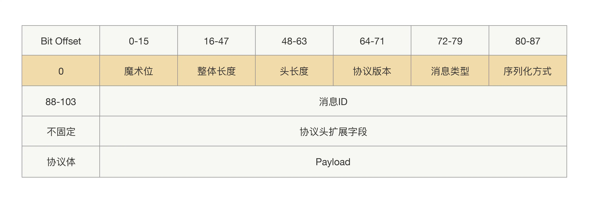

### 3.2 http2

#### rfc7540

##### 1. http frame
```text
 +-----------------------------------------------+
 |                 Length (24)                   |
 +---------------+---------------+---------------+
 |   Type (8)    |   Flags (8)   |
 +-+-------------+---------------+-------------------------------+
 |R|                 Stream Identifier (31)                      |
 +=+=============================================================+
 |                   Frame Payload (0...)                      ...
 +---------------------------------------------------------------+
 ```

 ## 4. 序列化

将对象转换为二进制数据的过程

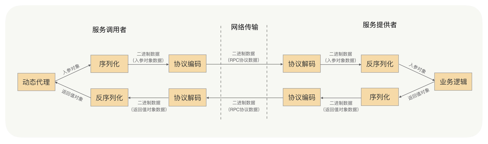

#### 几种序列化方式

+ JDK原生
+ JSON
+ Hessian
+ Protobuf

#### 如何选择

+ 性能和效率
+ 空间开销
+ 通用性和兼容性
+ 安全性

#### 注意点

+ 对象要尽量简单，没有太多的依赖关系，属性不要太多，尽量高内聚；
+ 入参对象与返回值对象体积不要太大，更不要传太大的集合；
+ 尽量使用简单的、常用的、开发语言原生的对象，尤其是集合类；
+ 对象不要有复杂的继承关系，最好不要有父子类的情况

## 5. I/O模型

### 常见I/O模型

+ BIO
+ NIO
+ EPOLL
+ AIO

#### 常用模型

+ Golang 同步阻塞
+ Nginx I/O多路复用

### 零拷贝

#### 数据同步流程

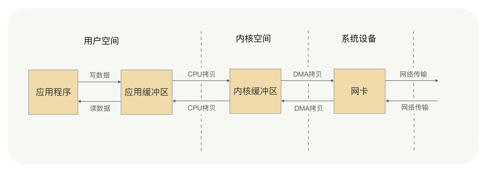

#### 零拷贝

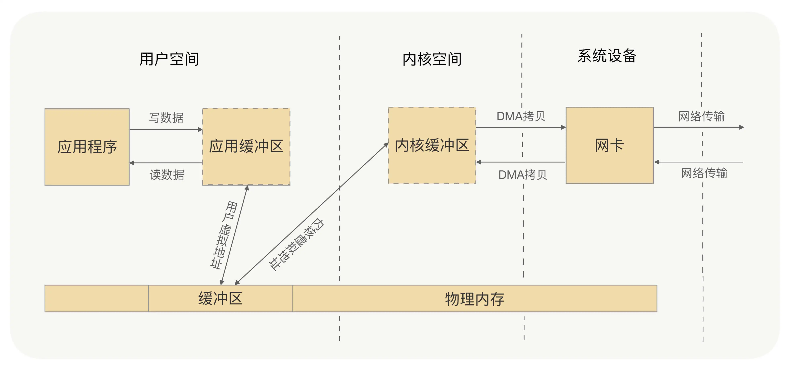

+ mmap + write
+ sendfile

#### Netty中的零拷贝

## 6.动态代理

##### 6.1 基本流程

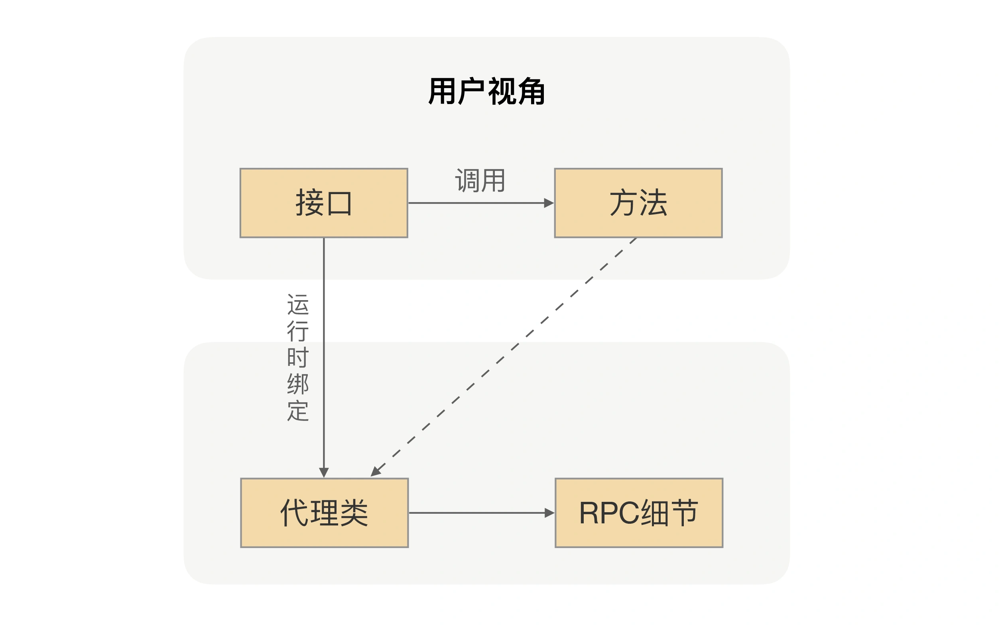

使用户不用关注细节

## 7.gRPC

#### gRPC流程

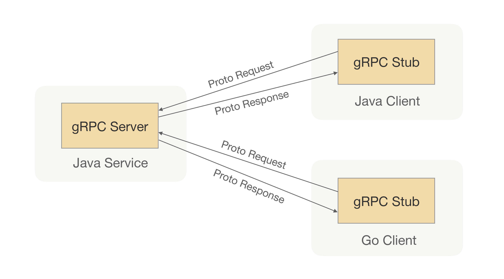

#### 7.1 客户端流程

+ 首先用 host 和 port 生成 channel 连接；
+ 然后用前面生成的 HelloService gRPC 创建 Stub 类；
+ 最后我们可以用生成的这个 Stub 调用 say 方法发起真正的 RPC 调用，后续其它的 RPC 通信细节就对我们使用者透明了。

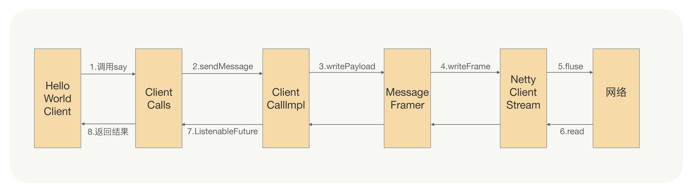

#### http2 frame

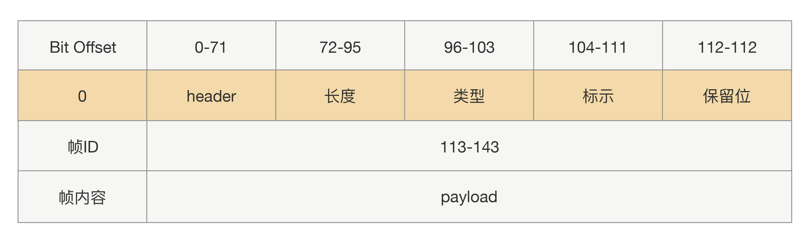
