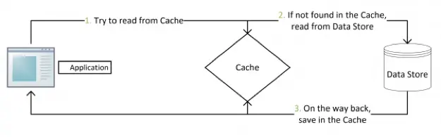
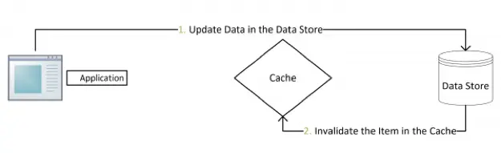
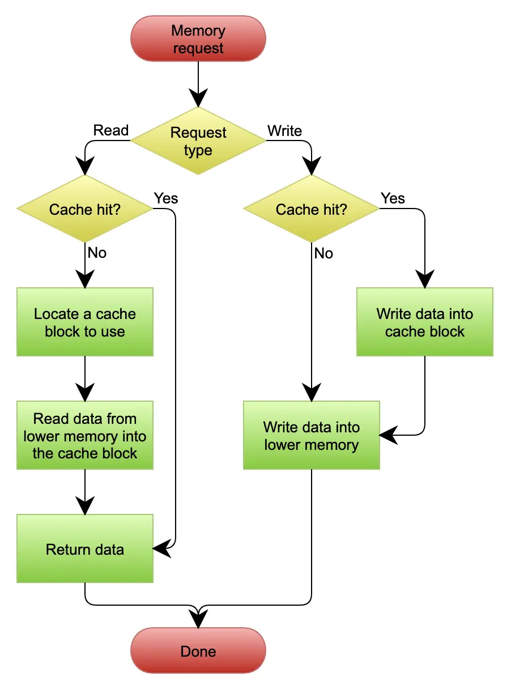
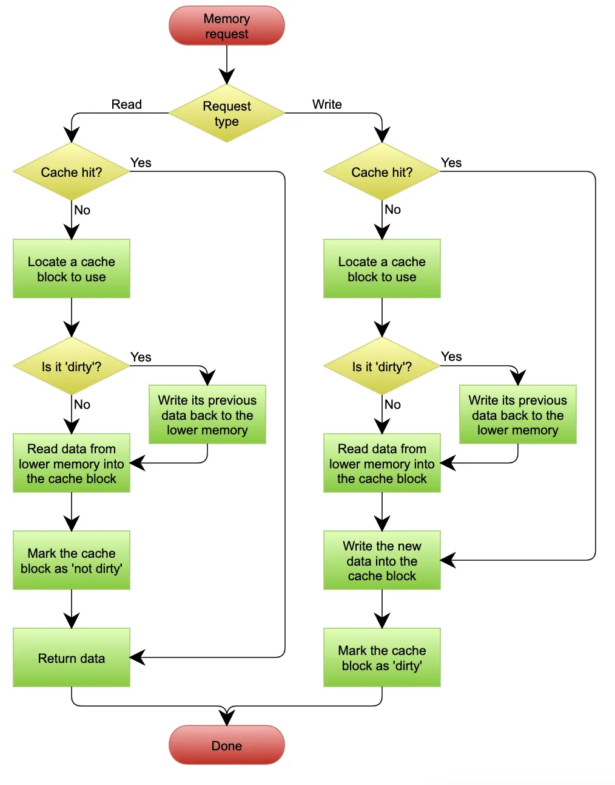

# 缓存

缓存是提高性能最好的方式,一般来说,缓存有以下三种模式

## Cache Aside

+ 失效：应用程序先从 Cache 取数据，如果没有得到，则从数据库中取数据，成功后，放到缓存中。
+ 命中：应用程序从 Cache 中取数据，取到后返回。
+ 更新：先把数据存到数据库中，成功后，再让缓存失效。

## Read/Write Through更新模式

## Write Behind Caching 更新模式

