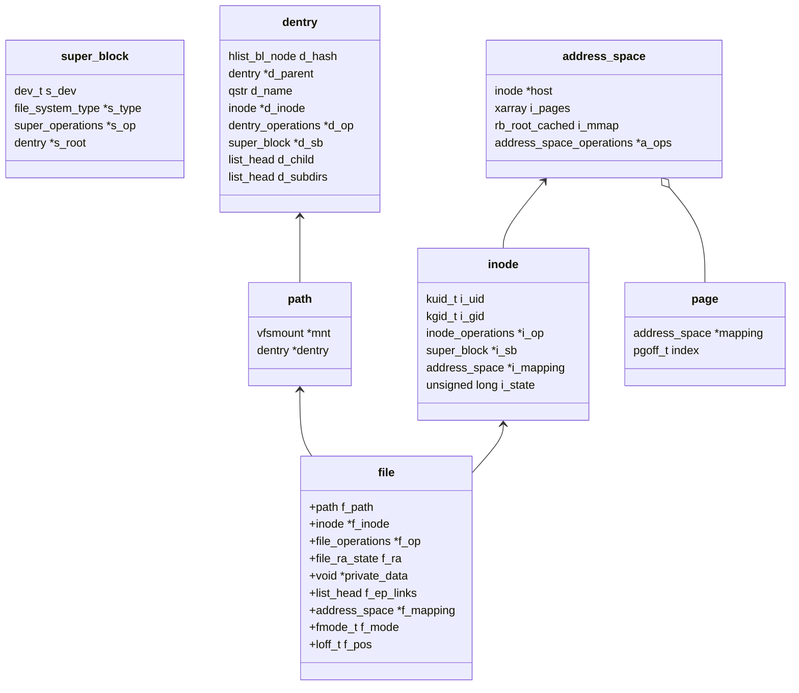
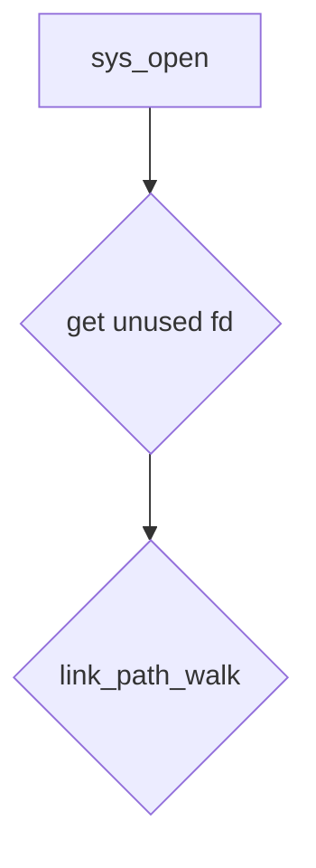

# VFS

## 核心数据结构

```mermaid
 classDiagram
      class file{
          +path f_path
          +inode *f_inode
          +file_operations *f_op
          +file_ra_state f_ra
          +void *private_data
          +list_head f_ep_links
          +address_space *f_mapping
          +fmode_t f_mode
          +loff_t f_pos
      }
      class super_block {
          dev_t s_dev
          file_system_type *s_type
          super_operations *s_op
          dentry *s_root
      }
      class dentry {
          hlist_bl_node d_hash
          dentry *d_parent
          qstr d_name
          inode *d_inode
          dentry_operations *d_op
          super_block *d_sb
          list_head d_child
          list_head d_subdirs
      }
      class page {
          address_space *mapping
          pgoff_t index
      }
      class address_space {
          inode *host
          xarray i_pages
          rb_root_cached i_mmap
          address_space_operations *a_ops
      }
      class inode {
          kuid_t i_uid
          kgid_t i_gid
          inode_operations *i_op
          super_block *i_sb
          address_space *i_mapping
          unsigned long i_state
      }
      class path {
          vfsmount *mnt
          dentry *dentry
      }
      path <-- file
      inode <-- file
      dentry <-- path
      address_space <-- inode
      address_space o-- page
```

#### 详解

#### address_space

关联文件系统和内存

#### 流程

##### sys_open

```mermaid
graph TD
    A[sys_open] --> B{get unused fd}
    B --> C{link_path_walk}
```