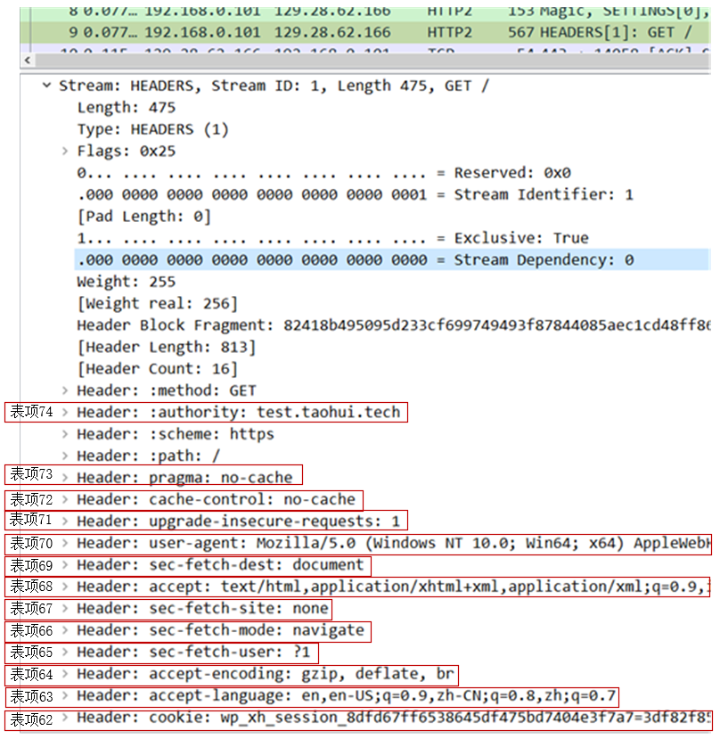
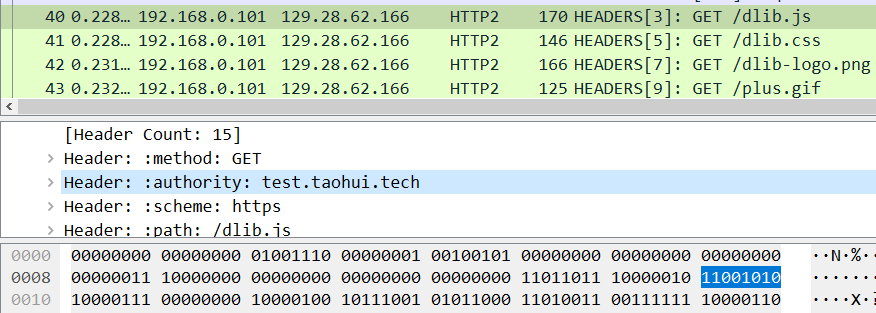

# HTTP2

## 现状

目前很多Web服务器,如nginx, tomcat都已经支持http2.  
HTTP2主要是在应用层面上优化,HTTP3现在也经历了多个草案,推出在即,它的目标是在传输层优化.  
通过了解HTTP2能帮我们更好的了解如何设计协议并为学习使用HTTP3打下基础.

### 优点

#### 提升头部编码效率

http1.1使用ascii编码头部效率太低,浪费大量带宽.HTTP2使用静态表/动态表(HPACK)两种编码技术,  
极大地降低了头部体积.  

##### 静态编码

```http1.1
Host: test.taohui.tech\r\n
```

http1.1请求中的host头部指示了站点域名,上面占用了24字节.使用静态Huffman编码,可以压缩为13字节.


###### 实现方式

1. 基于二进制编码,不需要'\r','\n'和空格,只需要表示长度的一个字节来分隔.上图中的01000001就表示Host,  
而10001011及随后的11个字节表示域名.
2. 使用静态表来描述Host头部.静态表是http2将61个高频出现的头部,分别对应1个数字构造出一张表,然后分别由http2  
客户端和服务端支持.    
  
当收到"01000001"时,根据[RFC7541](https://datatracker.ietf.org/doc/html/rfc7541),前2位01表示是不包含值的静态表头部:  
  
再根据索引000001查静态表找到authority头部(http2将host改名为authority).剩下的字节表示域名,其中首个比特表示是否经过了  
Huffman编码,后7位表示长度.  
10001011表示经过了Huffman编码且长度为11.  
最后,使用静态Huffman编码表,http2通过统计互联网上大量http头部中字符出现的频率,将ASCCI码表重新编码为一张表即静态Huffman编码表,能够将8位的ASCII码最小缩小为5位,"test.taohui.tech"域名用到了10个字符,可以压缩将16个字节压缩为11个字节,如下所示:  
  

##### 动态编码

客户端和服务端根据相同的规则,对首次传递的HTTP头部用一个数字表示,后续再传递相同头部时传递数字即可.所有缓存的头部及其数字会构成一张  
表,它是根据传输过的请求动态构建出来的,因此叫"动态表".  
静态表有61项,因此动态表索引从62开始.

###### 具体实现

比如下图中的报文中，访问 test.taohui.tech 的第 1 个请求有 13 个头部需要加入动态表。其中，Host: test.taohui.tech 被分配到的动态表索引是 74（索引号是倒着分配的):  

  

这样后续再传递相同的Host头部时,只传输一个字节110011010即可,首位1表示在动态表中,后7位为索引74  



+ 是否在同一个连接上传递越多请求就越好呢?
    + 动态表会占用较多内存,影响并发能力.所以服务器一般会提供http2_max_requests来限制一个连接上能够传输的请求数量.
    + 因此,一个连接上不是请求越多越好,一般根据客户端浏览页面时访问的对象数量来设定这个值.

#### 支持并发传输请求

http1.1中的keepalive长连接选项虽然可以在一个连接上发送多个请求,但是响应必须按顺序返回(应用层头端阻塞).  
http2通过stream支持并发传输,而且呼应可以乱序返回(应用层乱序).因此,http/2能够明显提升单个连接的速度,  
这里有个[测试demo](https://http2.akamai.com/demo),可以直观感受一下.  


