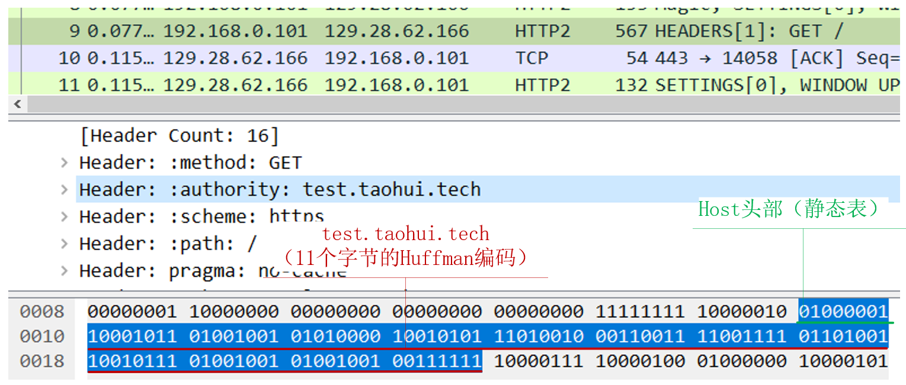
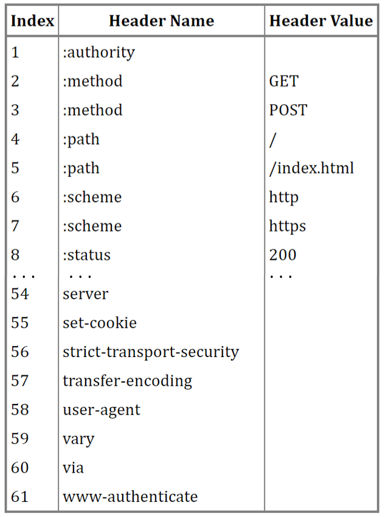
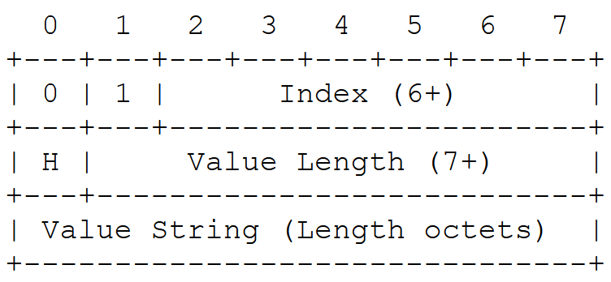
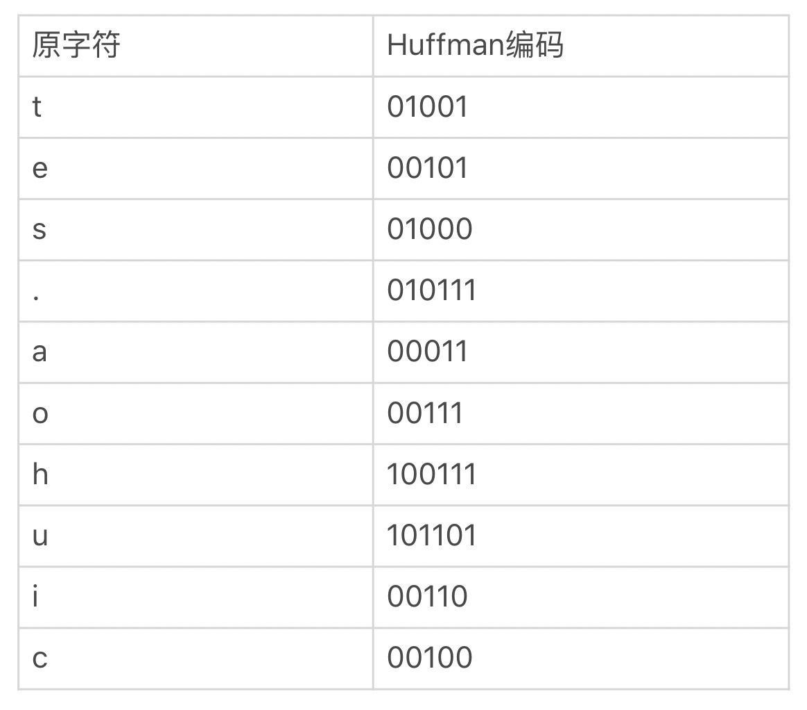

# HTTP2

## 现状

目前很多Web服务器,如nginx, tomcat都已经支持http2.  
HTTP2主要是在应用层面上优化,HTTP3现在也经历了多个草案,推出在即,它的目标是在传输层优化.  
通过了解HTTP2能帮我们更好的了解如何设计协议并为学习使用HTTP3打下基础.

### 优点

#### 提升头部编码效率

http1.1使用ascii头部编码效率太低,浪费大量带宽.HTTP2使用静态表/动态表(HPACK)两种编码技术,  
极大地降低了头部体积.  

##### 一个例子

```http1.1
Host: test.taohui.tech\r\n
```

http1.1请求中的host头部指示了站点域名,上面占用了24字节.使用静态Huffman编码,可以压缩为13字节.



###### 实现方式

1. 基于二进制编码,不需要'\r','\n'和空格,只需要表示长度的一个字节来分隔.上图中的01000001就表示Host,  
而10001011及随后的11个字节表示域名.
2. 使用静态表来描述Host头部.静态表是http2将61个高频出现的头部,分别对应1个数字构造出一张表,然后分别由http2  
客户端和服务端支持.    
  
当收到"01000001"时,根据[RFC7541](https://datatracker.ietf.org/doc/html/rfc7541),前2位01表示是不包含值的静态表头部:  
  
再根据索引000001查静态表找到authority头部(http2将host改名为authority).剩下的字节表示域名,其中首个比特表示是否经过了  
Huffman编码,后7位表示长度.  
10001011表示经过了Huffman编码且长度为11.  
最后,使用静态Huffman编码表,http2通过统计互联网上大量http头部中字符出现的频率,将ASCCI码表重新编码为一张表即静态Huffman编码表,如下所示:  



