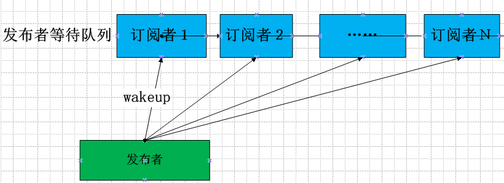

# epoll实现详解

epoll用于同时管理多个事件源,用于实现i/o多路复用.  
除了常见的网络事件外还有信号、定时器等.  
今天来详细分析一下epoll在linux内核中的实现.

## 订阅者模式

epoll用于管理事件源,因此这里是一个常见的发布订阅者模式.  
linux内核使用wait_queue_head_t来实现.  

+ 事件订阅者将自己加入到事件源的等待队列中
+ 当事件发生时,事件源唤醒等待队列上的订阅者

### 发布者实现

为了支持订阅者模式,发布者文件需要支持poll操作,poll操作通常将等待者和自己的等待队列关联起来  
这样在有相应事件就绪时,可以通知等待者

### epoll实现

epoll需要管理多个事件源,在事件源就绪时需要能够唤醒当前进程执行.

#### 事件的管理

